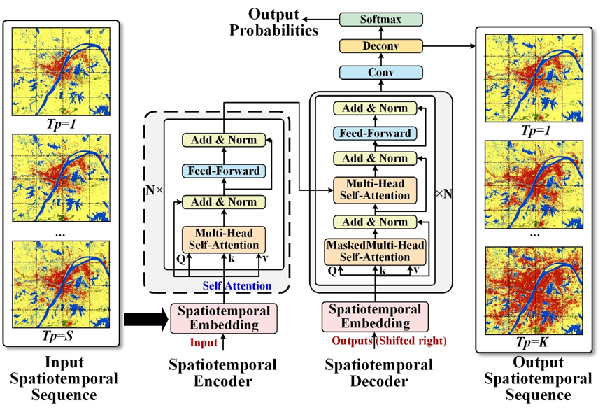
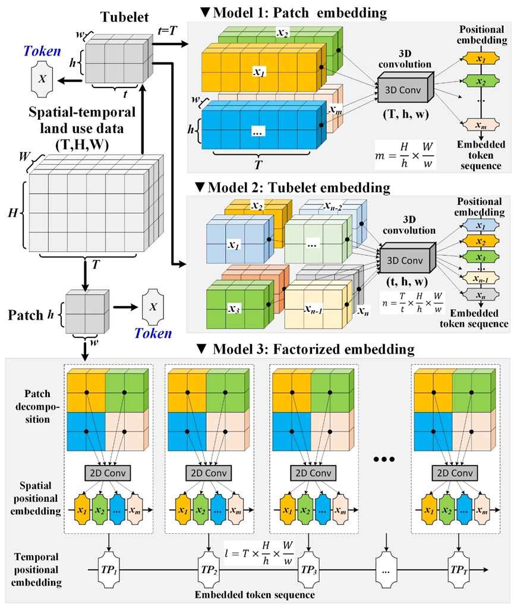

# Introduction to LandTrans

LandTrans is a cutting-edge spatial-temporal transformer model designed for large-scale, time series simulation of land use/cover change (LUCC). This innovative approach represents a significant departure from traditional LUCC modeling techniques.

<div style="text-align: center;">
  
  <br>
  <strong>Figure 1. Framework of the LandTrans model.</strong>
</div>


## Key Features:

1. **Fully Data-Driven:** Unlike conventional models, LandTrans does not rely on prior knowledge of LUCC or predetermined spatiotemporal driving mechanisms. Instead, it harnesses the power of data to uncover patterns and relationships.

2. **Transformer Architecture:** At its core, LandTrans utilizes the self-attention mechanism of the Transformer architecture. This allows the model to directly capture and learn complex spatiotemporal patterns and evolution rules inherent in LUCC time series data.

3. **Advanced Embedding Strategies:** Drawing inspiration from successful approaches in image and video processing (such as ViT and ViViT models), LandTrans implements three sophisticated spatiotemporal embedding strategies:
   - Patch Embedding
   - Tubelet Embedding
   - Factorized Embedding

<div style="text-align: center;">
  
  <br>
  <strong>Figure 2. Different spatial-temporal embedding strategies in the LandTrans model..</strong>
</div>


These strategies enable effective decomposition and representation of LUCC spatiotemporal data, enhancing the model's ability to understand and predict land use changes.

By combining these advanced techniques, LandTrans offers a powerful and flexible tool for simulating and understanding land use/cover changes across large scales and over extended time periods. This model opens new possibilities for urban planning, environmental management, and policy-making in the context of rapidly changing landscapes.


## 2. Installation

### 2.1 System Requirements

- Python 3.12
- Compatible with Windows and Linux operating systems
- NVIDIA GPU with CUDA support (recommended for optimal performance)

### 2.2 Dependencies

The LandTrans model relies on the following Python packages:

- pandas
- matplotlib
- scikit-learn
- tqdm
- torch>=2.1.0+cu121
- torchvision>=0.14.0+cu121
- torchaudio>=2.1.0+cu121
- rasterio
- geopandas
- GDAL

### 2.3 Step-by-Step Installation Guide

1. **Python Environment Setup**:
   - Ensure Python 3.12 is correctly installed on your system.
   - Decide whether to use a virtual environment (recommended) or install directly in your base Python environment.

2. **Clone the Repository**:
   ```
   git clone https://github.com/Land623/LandTrans.git
   cd [repository directory]
   ```

3. **Install Dependencies**:
   ```
   pip install -r requirements.txt
   ```
   Ensure you provide the full path to `requirements.txt` if not in the current directory.

4. **GDAL Installation**:
   - If `pip` fails to install GDAL, you have two options:  
     a. For Python 3.12 users: Install the pre-compiled wheel file included in the repository:
        ```
        pip install ./GDAL-3.8.4-cp312-cp312-win_amd64.whl
        ```
     b. For other Python versions: Visit https://pypi.org/project/GDAL/ for installation instructions.
   - After successful GDAL installation, rerun `pip install -r requirements.txt` to ensure all dependencies are properly installed.

5. **Verify CUDA Installation**:
   To confirm proper CUDA installation for GPU acceleration, run:
   ```python
   import torch
   print(torch.__version__)
   print(torch.cuda.is_available())
   ```
   This will display your PyTorch version and whether CUDA is available.

**Note**: GPU acceleration significantly enhances model performance. Without it, the model will default to CPU computation, potentially impacting efficiency.


## 3. Project Structure

The LandTrans project is organized into several key directories and files:

```
LandTrans/
│
├── demo/
│   ├── Cfgs/
│   │   └── [configuration files]
│   └── data/
│       ├── CLCD_WH/
│       └── NCLD_CLT/
│
├── models/
│   └── [embedding strategy implementations]
│
├── utils/
│   └── [data access and model parameter scripts]
│
├── LUCCTrainer.py
├── LUCCSimulator.py
└── run_demo.py
```

### Key Components:

1. **demo/**
   - **Cfgs/**: Contains JSON configuration files for model runs.
     - File naming convention: `[DATASET(8chars)]_[MODEL_ARCH(7chars)].json`
       - MODEL_ARCH:
         - Model11, Model12: Patch embedding
         - Model21, Model22: Tubelet embedding
         - Model31, Model32: Factorized embedding
         - Models ending in 1 (e.g., 11, 21, 31): Encoder-decoder architecture
         - Models ending in 2 (e.g., 12, 22, 32): Decoder-only architecture
   - **data/**: Stores datasets
     - CLCD_WH: China Land Cover Dataset
       - 30-meter spatial resolution
       - 9 land cover classes
       - Time series since 1990
       - 79.31% overall accuracy
     - NCLD_CLT: National Land Cover Database (US)
       - 30-meter spatial resolution
       - Time series from 2001 to 2021
       - 8 primary and 16 secondary land cover classes

2. **models/**: Implementations of different spatiotemporal embedding strategies

3. **utils/**: Scripts for spatiotemporal data access and model parameter I/O

4. **LUCCTrainer.py**: LandTrans model training module

5. **LUCCSimulator.py**: Model inference and simulation module

6. **run_demo.py**: Model demonstration module


## 4. Quick Start

### 4.1 Running the Demo

After installing Python and all required dependencies, you can quickly test the model using the provided demo data:

1. Run the demo:
   ```
   python run_demo.py
   ```

2. Customizing the demo run:
   - Modify lines 211-218 in `run_demo.py` to adjust the model's task.
   - To run multiple experiments with the same parameters, change `repeat_times` on line 211 (e.g., `repeat_times=30` for 30 repetitions).
   - To run multiple configuration files, modify the `config_files` list on lines 217-218.

3. Accessing results:
   - Default output directory: `./Demo/Output`
   - `metrics.csv`: Contains model accuracy evaluation results.
   - `Prediction/`: Stores the best performing model's predictions for future LUCC.
   - `Simulation/`: Contains results from each independent run, including:
     - `trained_model.pth`: Trained model file
     - `Accuracy/`: Confusion matrix data for accuracy evaluation
     - `Test/`: LUCC time series data generated from the test set

### 4.2 Using Your Own Data

To run LandTrans with your own data:

1. Prepare a time series LUCC dataset (minimum 9 time steps recommended).
2. Ensure all datasets have the same geographic coordinate system, spatial resolution, and extent (use GIS software if needed).
3. Reclassify land cover classes to consecutive integers (e.g., 1-6 for 6 classes) using GIS software.
4. Place all LUCC data files in one directory and create a `data_list.txt` file listing the filenames in chronological order.
5. Create a parameter file based on `Demo\Cfgs\CLCD_WH_Model11.json`, updating `lucc_data_path` and `output_path` accordingly.
6. Customize the model:
   - Modify `model_type` to "M11", "M12", "M21", "M22", "M31", or "M32" for different architectures.
   - Adjust hyperparameters like `region_size`, `seq_len`, `label_len`, and `embed_dim` as needed.
7. Add the path of your modified parameter file to the `config_files` list in `run_demo.py` (line 217).
8. Run the model using `python run_demo.py`.

### 4.3 Tips for Using CLCD and NCLD Datasets

- CLCD (China Land Cover Dataset):
  - 30-meter spatial resolution
  - 9 land cover classes
  - Time series since 1990
  - 79.31% overall accuracy

- NCLD (National Land Cover Database, US):
  - 30-meter spatial resolution
  - Time series from 2001 to 2021
  - 8 primary and 16 secondary land cover classes

These datasets are recommended for their comprehensive coverage and temporal range, making them suitable for LUCC simulation tasks.
